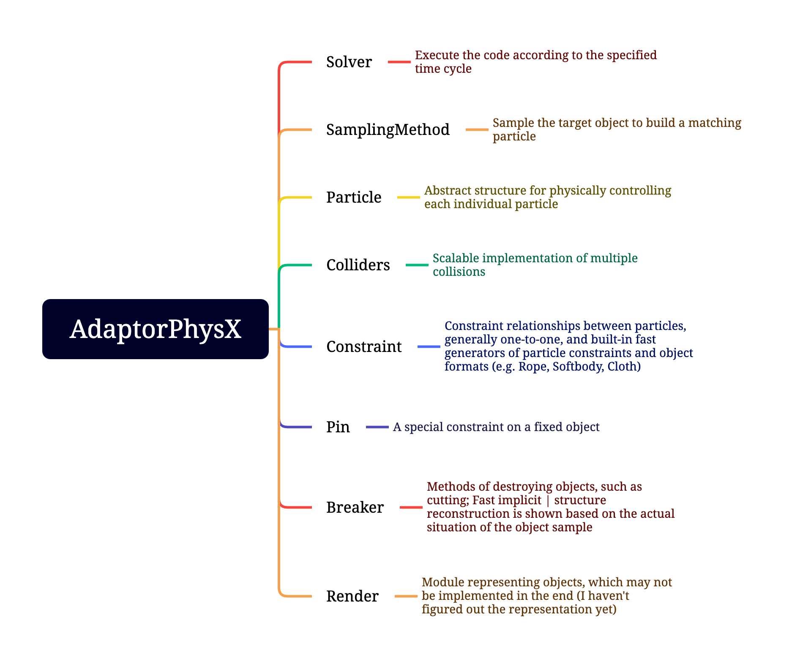

# AdaptorPhysX

This project is not finished, i will push it on next spring.

AdaptorPhysX full name is: Adaptive Physics Extension, abbreviation: APEX. this project try to use PBD (position based dynamics) algorithm to simulate a deformable object with volume or surface, and implement a calculation framework according to PBD calculation rules.
PBD algorithm is more used in non-rigid body fabric algorithm, so I decided to try this algorithm applied to the settlement of flexible body.

What is PBD: https://matthias-research.github.io/pages/publications/posBasedDyn.pdf

## Models

This project contains the following modules:

## Effect

(waiting for upload)

## Custom, rewrite

(waiting for project finished)

About：

My blog about PBD，URL：https://www.mustenaka.cn/index.php/2023/09/06/pbd-method-learn-01/

Adaptive Physics Extension: AdaptorPhysX, APEX

