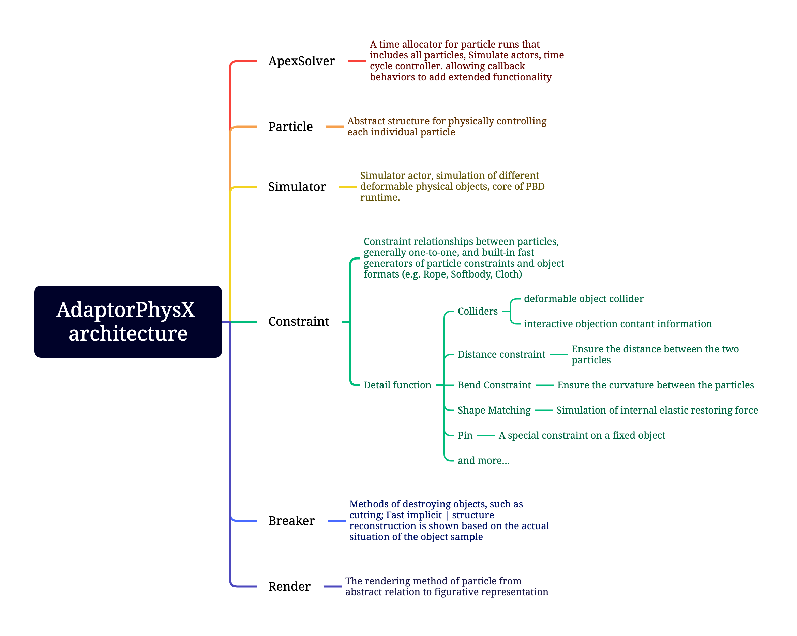
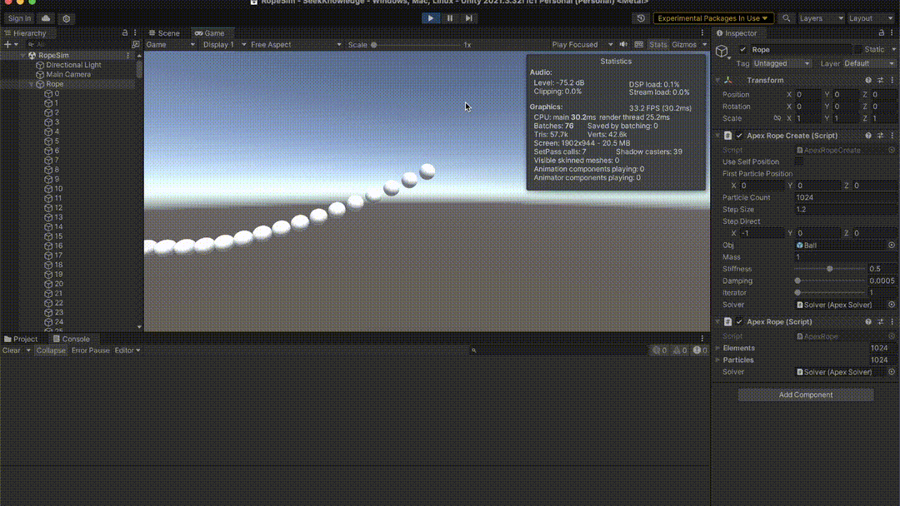

# AdaptorPhysX

[中文](./Docs/README_ZH-CN.md)

AdaptorPhysX project try to use CPU mutil threading(Unity Burst & Jobs system) implement PBD (Position Based Dynamics) algorithm to simulate a deformable object(rope, cloth, softbody, fluid) with volume or surface, and implement a calculation framework according to PBD calculation rules.  You can complete your own algorithm expansion based on this project.

What is PBD: https://matthias-research.github.io/pages/publications/posBasedDyn.pdf

## Require

 Require unity ECS architecture. (Entities is not necessary), plz 

> Windows – Package Manager – Add package from git URL - input: com.unity.jobs 

- com.unity.burst - 1.8.9
- com.unity.jobs  - 0.70.0-preview.7
- com.unity.mathematics - 1.2.6

##### Unity

In version 2022.3.13, there is a Bug in the display of schemas in Unity, which causes the Constraint to not operate properly in Inspector, so you can only wait for the official Unity update.

reference: https://github.com/Mustenaka/AdaptorPhysX/issues/1

## Project architecture:

This project architecture:

## Effect

##### Rope:

1 rope, with **1024 interactive particles**, iterator 1, constraint have, distance, pin, DOTS optimize

### Cloth:

[not finish]

### Softbody:

[not finish]

## Custom, rewrite

(waiting for project finished)

## TODO

## My Blog (Chinese)

My blog about PBD，URL：https://www.mustenaka.cn/index.php/2023/09/06/pbd-method-learn-01/

> AdaptorPhysX full name is: Adaptive Physics Extension, namespace abbreviation: APEX.
